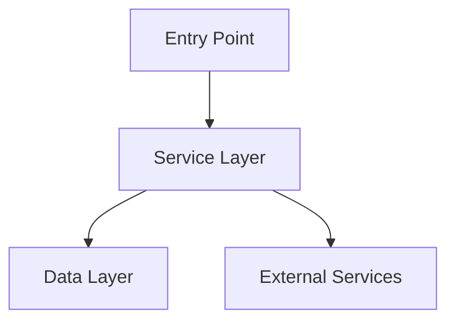

## Architecture Notes

Este documento descreve a arquitetura, padrões de design e decisões técnicas do projeto 'nome-do-projeto'.

## System Architecture Overview

**Architecture Style**: Single Page Application (SPA) Angular com integração ERP Protheus

**Key Components**:

- **Shell (AppComponent)**: Toolbar + Menu + RouterOutlet; detecta contexto Protheus na inicialização
- **Feature Pages**: Componentes standalone com lazy loading via roteamento
- **HTTP Layer**: `HttpClient` + `LibCoreDevInterceptorService` (baseado em `PoHttpInterceptor`)
- **Config Layer**: `APP_INITIALIZER` carrega `appConfig.json` antes do bootstrap

**Request Flow**:

1. `main.ts` faz bootstrap com `bootstrapApplication(AppComponent, appConfig)`
2. `APP_INITIALIZER` executa `appInitializer` (carrega `appConfig.json`)
3. `AppComponent` detecta contexto Protheus via `ProAppConfigService.insideProtheus()`
4. Router resolve rotas lazy; componentes de feature são carregados sob demanda
5. `LibCoreDevInterceptorService` intercepta todas as requisições HTTP

## Architectural Layers

- **Presentation Layer** (`src/app/`) — Componentes Angular standalone com PO UI
- **Routing** (`src/app/app.routes.ts`) — Lazy loading de páginas/features
- **Services** (`src/app/services/`) — Interceptors e serviços HTTP
- **Shared Modules** (`src/app/modules/`) — Barrel de imports PO UI reutilizáveis
- **Configuration** (`src/assets/data/`, `src/environments/`) — Config por ambiente

## Detected Design Patterns

| Pattern               | Locations                       | Description                                            |
| --------------------- | ------------------------------- | ------------------------------------------------------ |
| Standalone Components | `src/app/**/*.ts`               | Angular 19 sem NgModules tradicionais                  |
| Barrel Module         | `src/app/modules/lib-core-dev/` | Agrupa imports PO UI comuns                            |
| APP_INITIALIZER       | `src/app/app-initializer.ts`    | Carrega config antes do bootstrap                      |
| HTTP Interceptor      | `src/app/services/`             | Intercepta requisições para notificações e screen-lock |
| Lazy Routes           | `src/app/app.routes.ts`         | Code splitting via `loadComponent`                     |

## Entry Points

- [`src/main.ts`](../src/main.ts) — Bootstrap Angular standalone
- [`src/app/app.config.ts`](../src/app/app.config.ts) — Providers e configurações
- [`src/app/app.routes.ts`](../src/app/app.routes.ts) — Definição das rotas

## Public API

| Symbol                         | Type       | Location                                               |
| ------------------------------ | ---------- | ------------------------------------------------------ |
| `AppComponent`                 | Component  | `src/app/app.component.ts`                             |
| `HomeComponent`                | Component  | `src/app/home/home.component.ts`                       |
| `LibCoreDevModule`             | NgModule   | `src/app/modules/lib-core-dev/lib-core-dev.module.ts`  |
| `LibCoreDevInterceptorService` | Injectable | `src/app/services/lib-core-dev-interceptor.service.ts` |

## Internal System Boundaries

- **UI ↔ HTTP**: O `LibCoreDevInterceptorService` é a fronteira; componentes não fazem HTTP diretamente
- **App ↔ Protheus**: `ProAppConfigService` isola a dependência `@totvs/protheus-lib-core`
- **Config ↔ App**: `APP_INITIALIZER` garante que `appConfig.json` é carregado antes de qualquer componente renderizar

## External Service Dependencies

- **Protheus ERP** — Integração via `@totvs/protheus-lib-core`; detecta se a app está rodando dentro do Protheus
- **PO UI CDN (opcional)** — Fontes Nunito Sans e ícones Animalia; podem ser servidos localmente
- **APIs REST** — Configuradas via `src/environments/environment.*.ts`

## Key Decisions & Trade-offs

- **Decision**: Angular 19 Standalone (sem NgModules tradicionais)
  - **Context**: Simplificação de imports, tree-shaking melhorado
  - **Consequences**: Cada componente declara seus próprios imports

- **Decision**: PO UI como único design system
  - **Context**: Padronização visual TOTVS obrigatória
  - **Consequences**: Todos os componentes UI devem ser de `@po-ui/ng-components`

- **Decision**: Ícones Animalia (não Polcon)
  - **Context**: Polcon está depreciado e será removido na v20
  - **Consequences**: Usar prefixo `an an-*` em todos os ícones

## Top Directories Snapshot

- `src/app/` — Lógica Angular (6 componentes, 1 serviço, 1 módulo)
- `src/assets/` — Imagens e configuração estática
- `src/environments/` — Configuração multi-ambiente (dev, local, prod)
- `.context/` — Contexto AI para agentes e documentação

## External Service Dependencies

- **Protheus ERP** — Integração via `@totvs/protheus-lib-core`; detecta se a app está dentro do Protheus
- **APIs REST TOTVS** — URLs configuradas em `src/environments/`; autenticadas pelo Protheus
- **PO UI CDN (opcional)** — Fontes Nunito Sans e Animalia Icons; serviço local recomendado

## Key Decisions & Trade-offs

Document key architectural decisions here. Consider creating Architecture Decision Records (ADRs) for significant choices.

**Template**:

- **Decision**: [What was decided]
- **Context**: [Why this decision was needed]
- **Alternatives**: [What else was considered]
- **Consequences**: [Impact of this decision]

## Diagrams

_Replace with actual system architecture diagram._

## Risks & Constraints

- **Dependência do Protheus**: A detecção de contexto falha silenciosamente fora do ERP; sempre testar em modo standalone também
- **PO UI Version Lock**: `@po-ui/ng-*` e `@angular/*` devem ter versões compatíveis; v19 de ambos
- **Bundle Size**: PO UI é uma dependência grande; usar lazy loading em todas as rotas
- **Deprecações Próximas**: Polcon removido na v20; Gauge standalone removido; po-navbar removido; migrar antes do upgrade

## Top Directories Snapshot

- `src/` — Source code
- `tests/` — Test files
- `docs/` — Documentation

_See [`codebase-map.json`](./codebase-map.json) for detailed file counts._

## Related Resources

- [Project Overview](./project-overview.md)
- [Data Flow](./data-flow.md) (if applicable)
- [Codebase Map](./codebase-map.json)

## Related Resources

<!-- Link to related documents for cross-navigation. -->

- [project-overview.md](./project-overview.md)
- [data-flow.md](./data-flow.md)
- [codebase-map.json](./codebase-map.json)
